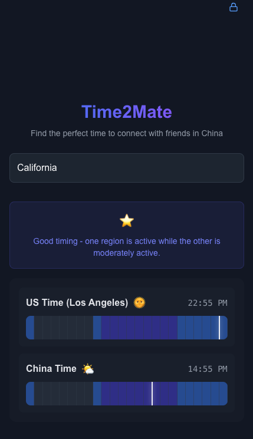

# Time2Mate

Time2Mate is a web application designed to help users find the optimal time for connecting with friends and colleagues in China across different time zones. It provides a visual representation of time zones and activity levels to make scheduling easier.



## Features

- 🌍 US State-based timezone selection
- 🕒 Real-time timezone visualization
- 🔄 Live time updates
- 💾 Save preferred timezone settings
- 🎯 Activity level indicators
- 📊 Visual time comparison bars

## Key Benefits

- Easily find overlapping active hours between US and China
- Visual activity status indicators (Active 🌞, Moderate 🌤️, Inactive 🌙)
- Instant feedback on optimal meeting times
- Persistent settings for frequent use

## Tech Stack

- **Framework**: Next.js 15
- **Language**: TypeScript
- **Styling**: Tailwind CSS
- **Time Management**: Day.js
- **UI Components**: Custom components with Lucide React icons
- **State Management**: React Hooks

## Getting Started

1. Clone the repository:
```bash
git clone https://github.com/yourusername/time2mate.git
```

2. Install dependencies:
```bash
npm install
```

3. Run the development server:
```bash
npm run dev
```

4. Open [http://localhost:3000](http://localhost:3000) in your browser

## Usage

1. Enter your US state in the search box
2. The app will automatically display the time bars for your timezone and China
3. Use the lock button to save your preferred timezone
4. The colored bars indicate activity levels:
   - Blue sections: Active hours
   - Purple sections: Moderate activity
   - Gray sections: Inactive/sleeping hours

## Contributing

Contributions are welcome! Please feel free to submit a Pull Request.

## License

This project is licensed under the MIT License - see the LICENSE file for details.

## Acknowledgments

- Built with Next.js
- Styled with Tailwind CSS
- Icons provided by Lucide React
